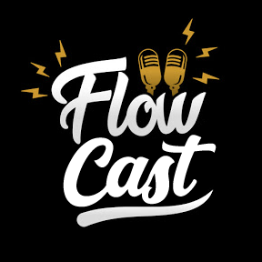

<p align="center">
  
</p>

# Flowcast

Flowcast is an internet-based platform that streams audio and video content, catering specifically to the podcast audience. The platform strives to provide the highest level of accessibility to all its users, aiming to deliver a unique and personalized user experience.

As an MVP developed for the first sprint of PUC-Rio's Post Graduation Course in Software Engineering, this product currently offers only basic functionalities.

## Flowcast Server

This repository contains all the necessary files to run the API project that powers the Flowcast platform. The application was built using the software design philosophy of Clean Architecture and Domain-Driven Design, using Python and Flask technology.

## Prerequisites

Before running the project, you need to have the following prerequisites installed on your system:

- Python 3.x version
- Pip
- sqlite3

To install all dependencies and run the project from the server on localhost on port 5000, use the following command:

```bash

# Install the dependencies in the requirements.txt
make install
# Execute the Flask server
make run
```

Alternatively, if you prefer to execute the project using Poetry, you can run:

```bash

poetry add $( cat requirements.txt )
```

## Running tests

To run the tests, you must have Python 3 and Pytest installed on your system.

To run the tests, follow these steps:

- Clone this repository to your local machine.
- In your terminal, navigate to the project's root directory.
- Install Pytest by running pip install pytest.
- Run pytest to execute all tests.

If all tests pass, you should see a summary of the tests run and their results.

If you would like to run a specific test file or test case, you can use the -k option followed by the name of the test file or test case.

For example, to run only the test cases for the Video class, run pytest -k "test_video".
